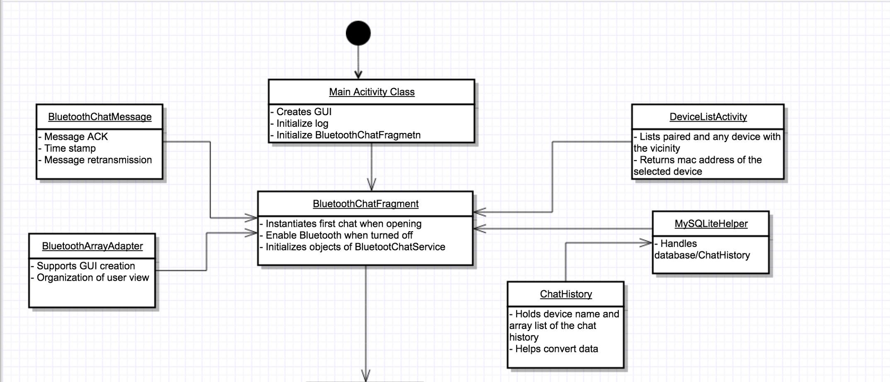
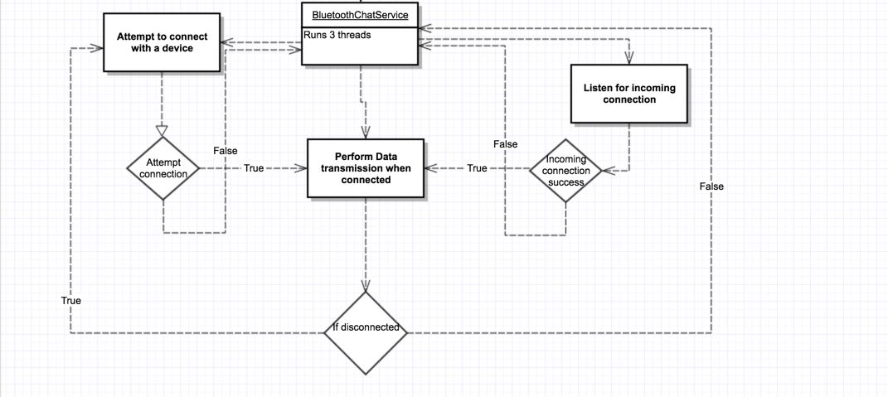

# Project Goal
Our group wanted to build a communication service that could be available in the event of no internet or mobile network connection. Thus, the primary goal of this project was to create a Android chat application over a bluetooth ad-hoc network. In order to achieve this, we needed to fulfill secondary goals of implementing core features of one-to-one chat such as message acknowledgement, message saving, and reconnection.

# Project Design

 

# File Structure

